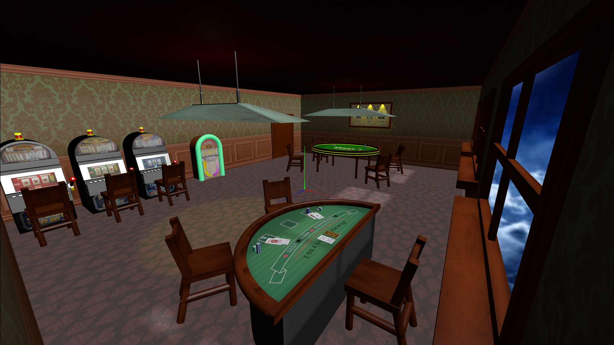

# SGI 2025/2026

## Group T06G04
| Name                 | Number    | E-Mail                        |
| -------------------- | --------- | ----------------------------- |
| Sérgio Nossa         | 202206856 | up202206856@fe.up.pt          |
| Pedro Marinho        | 202206854 | up202206854@fe.up.pt          |
| Ismael Moniz         | 202206871 | up202206871@fe.up.pt          |

----

## Projects

### [PW1 - ThreeJS Basics](pw1)

#### Tutorial

The tutorial of our class can be found here:

[SGI_TUTORIAL_PDF](tutorial/SGI_25_26_Requisites_PW1.pdf)

Along with its guide:

[SGI_TUTORIAL_GUIDE](tutorial/README.md)

#### Project Overview

Our project aims to develop a **THREE.js** scene inspired by a **vintage casino setting**. It will incorporate the use of **basic geometry, curves, transformations, materials, lighting, and shaders**, applying the techniques and concepts covered in our practical classes.

    
    
Figure 1: Project Overview

**More in depth information on pw1 can be found in [pw1's README](pw1/README.md)**

-----

### [PW2 - Aquatic Scenary](pw2)

#### Tutorial

The tutorial of our class can be found here:

[Guide PDF](pw2/docs/SGI%20-%20PW2%20full%20description.pdf)

#### Project Overview

A real-time **THREE.js aquarium simulation** featuring animated marine life, procedural terrain, advanced shaders, lighting, post-processing, and interactive physics.

**Highlights**:

- Modular scene architecture with multiple managers

- Procedural fish, corals, and terrain

- Flocking (boids), collision systems, and BVH acceleration

- Custom shaders, HDR lighting, and post-processing HUD

- Particle systems (marine snow, bubbles, sand puffs)

  <video src="./pw2/screenshots/sgi-demo.mp4" controls="controls" muted="muted" playsinline="playsinline">
  </video>

Figure 2: PW2 – Interactive aquatic environment

**More in depth information on pw2 can be found in [pw2's README](pw2/README.md)**
