# SGI 2025/2026 - PW1

## Group T06G04
| Name                 | Number    | E-Mail                        |
| -------------------- | --------- | ----------------------------- |
| Sérgio Nossa         | 202206856 | up202206856@fe.up.pt          |
| Pedro Marinho        | 202206854 | up202206854@fe.up.pt          |
| Ismael Moniz         | 202206871 | up202206871@fe.up.pt          |

----

## Tutorial

The tutorial of our class can be found here:

[SGI_TUTORIAL_PDF](tutorial/SGI_25_26_Requisites_PW1.pdf)

Along with its guide:

[SGI_TUTORIAL_GUIDE](tutorial/README.md)

## Project Overview

Our project aims to develop a **THREE.js** scene inspired by a **vintage casino setting**. It will incorporate the use of **basic geometry, curves, transformations, materials, lighting, and shaders**, applying the techniques and concepts covered in our practical classes.

    
    
Figure 1: Project Overview

Here’s your **Topics** list updated to include all the items — now in **alphabetical order** and consistent with your section names and anchors 👇

---

## Topics

- [SGI 2025/2026 - PW1](#sgi-20252026---pw1)
  - [Group T06G04](#group-t06g04)
  - [Tutorial](#tutorial)
  - [Project Overview](#project-overview)
  - [Topics](#topics)
    - [Requirements](#requirements)
      - [BlackJack Table](#blackjack-table)
      - [Chair](#chair)
      - [Door](#door)
      - [Floor and Walls](#floor-and-walls)
      - [Group Painting](#group-painting)
      - [JukeBox](#jukebox)
      - [Lamp](#lamp)
      - [Panorama and Windows](#panorama-and-windows)
      - [Poker Cards](#poker-cards)
      - [Poker Chips](#poker-chips)
      - [Poker Table](#poker-table)
      - [Shadows](#shadows)
      - [SlotMachines](#slotmachines)

---

### Requirements

#### BlackJack Table

A classic blackjack table featuring a curved design with a green felt surface and a wooden border.

    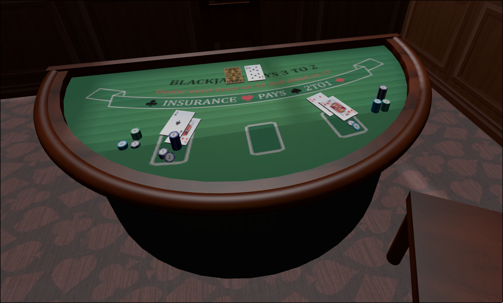
    
Figure 2: BlackJack Table

---

#### Chair

A simple casino wooden chair. It’s positioned near tables and slot machines for player comfort.

    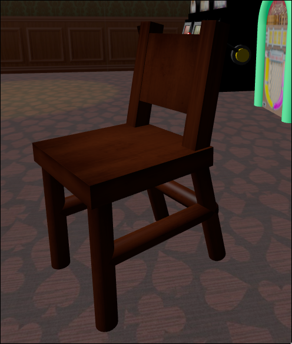
    
Figure 3: Chair

---

#### Door

A vintage wooden door with decorative details, serving as the main entrance to the casino.

    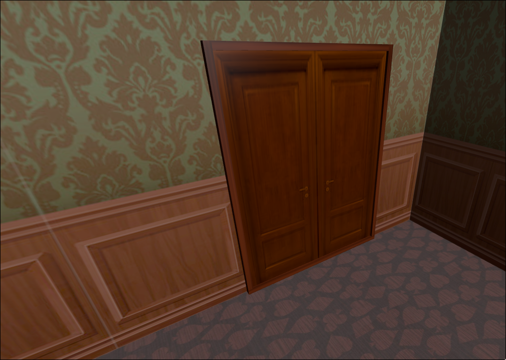
    
Figure 4: Door

---

#### Floor and Walls

The casino’s floor and walls are designed with textures that enhance the vintage atmosphere — a patterned carpet for the floor and wooden textures with patterns for the walls.

    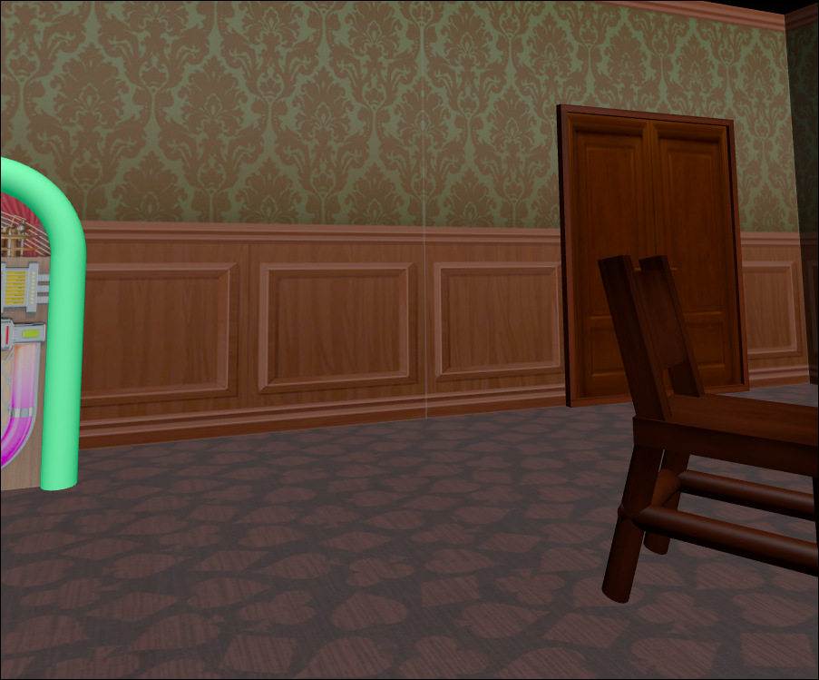
    
Figure 5: Floor and Walls

---

#### Group Painting

A framed wall painting representing the project group, inspired by vintage art styles. It serves as a decorative element on one of the casino’s walls, giving a personal touch to the environment.

    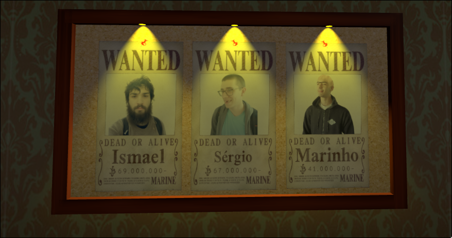
    
Figure 6: Group Painting

---

#### JukeBox

A retro-style jukebox with colorful lights and metallic details, adding to the nostalgic ambiance of the casino.

    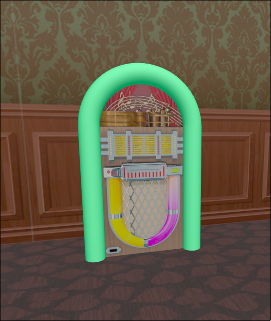
    
Figure 7: JukeBox

---

#### Lamp

A hanging ceiling lamp casting warm light over nearby tables, contributing to the overall cozy environment.

    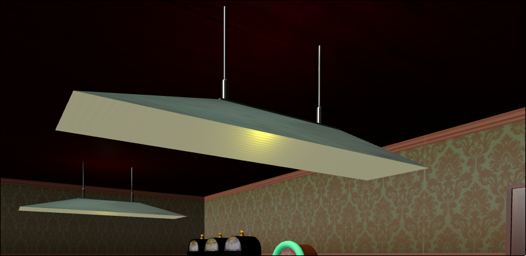
    
Figure 8: Lamp

---

#### Panorama and Windows

A panoramic background image that surrounds the scene, that can be seen through the windows.

    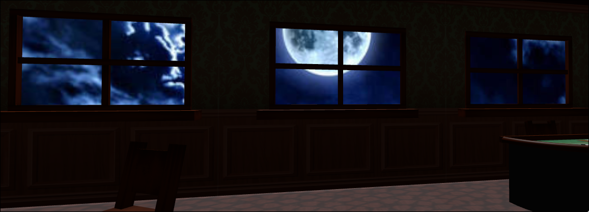
    
Figure 9: Panorama and Windows

---

#### Poker Cards

A small set of playing cards spread across the poker table. The cards use textured materials to display realistic designs, contributing to the authentic casino atmosphere.

    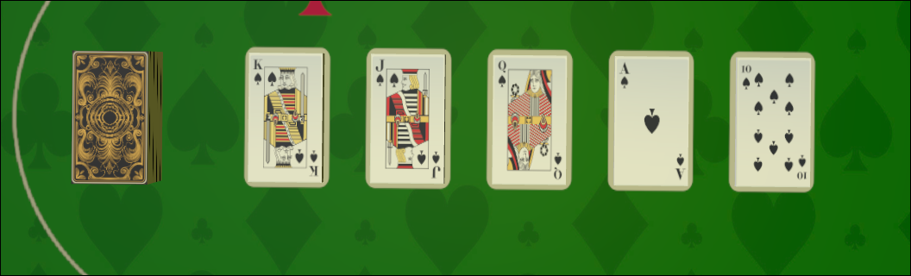
    
Figure 10: Poker Cards

---
#### Poker Chips

Stacks of colorful poker chips placed on the poker and blackjack tables. Each chip type uses different colors and materials to represent various denominations, adding visual detail and realism to the scene.

    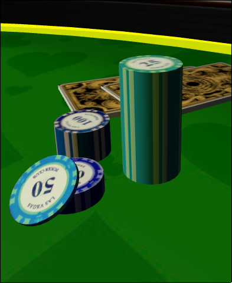
    
Figure 11: Poker Chips

---

#### Poker Table

A round table covered in green felt, surrounded by chairs and equipped with chips and cards, representing a classic poker setup.

    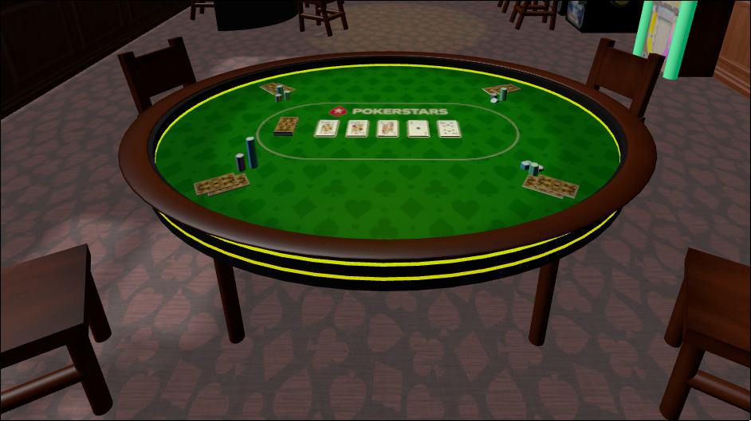
    
Figure 12: Poker Table

---

#### Shadows

Shadows are enabled for key objects in the scene to enhance depth and realism, particularly the light through the windows.

    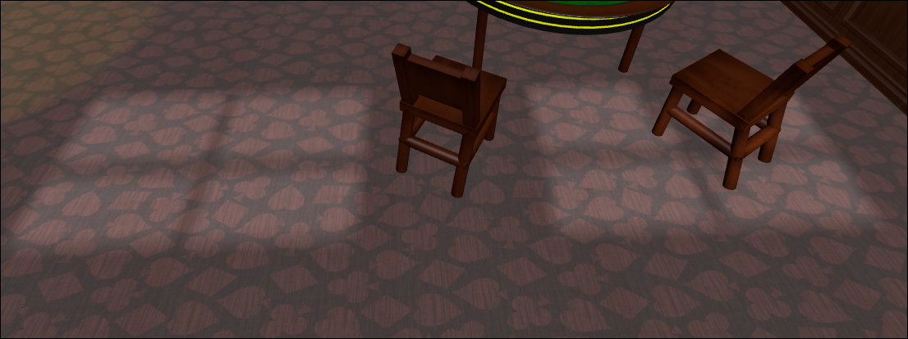
    
Figure 13: Shadows

---

#### SlotMachines

Vintage slot machines with a lever, and different textures.

    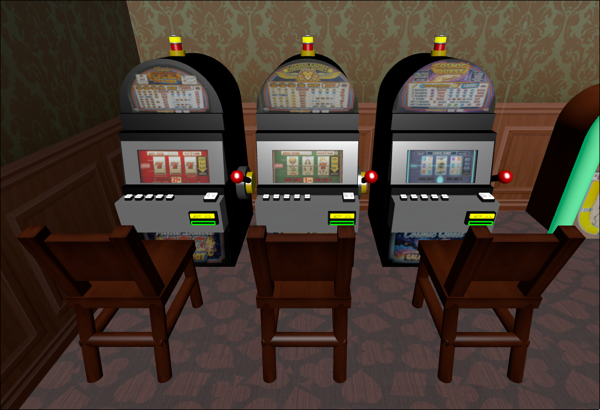
    
Figure 14: SlotMachine

---

