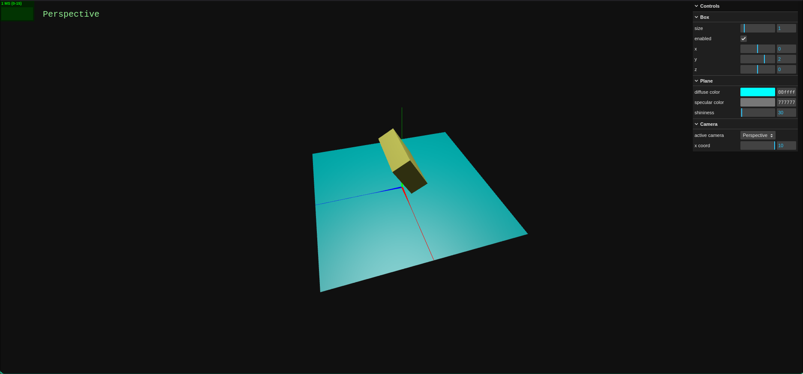
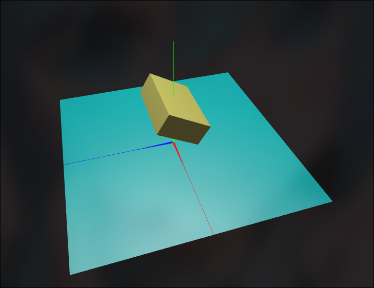
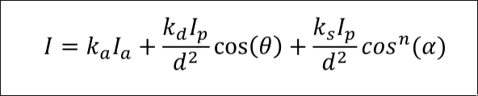
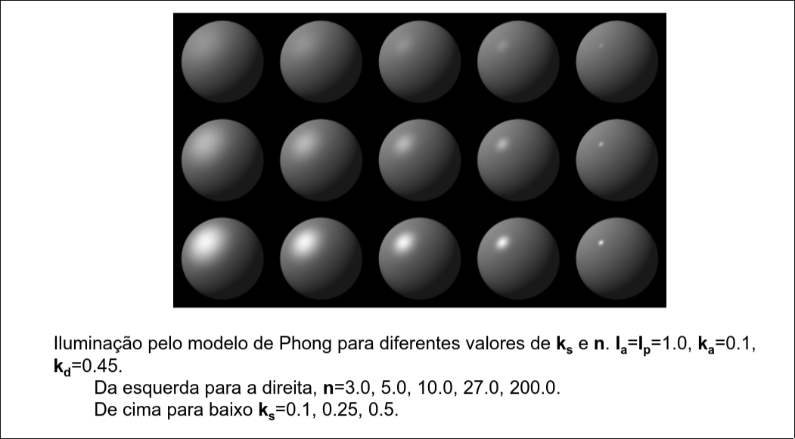
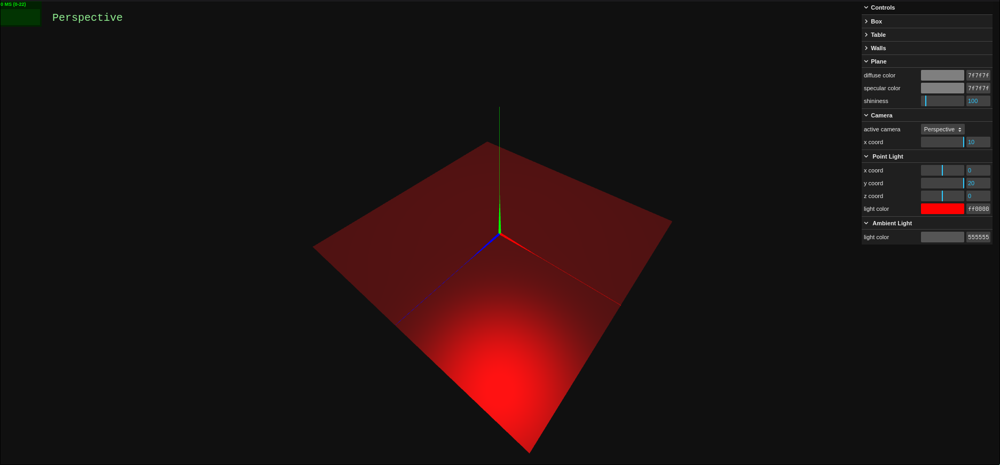
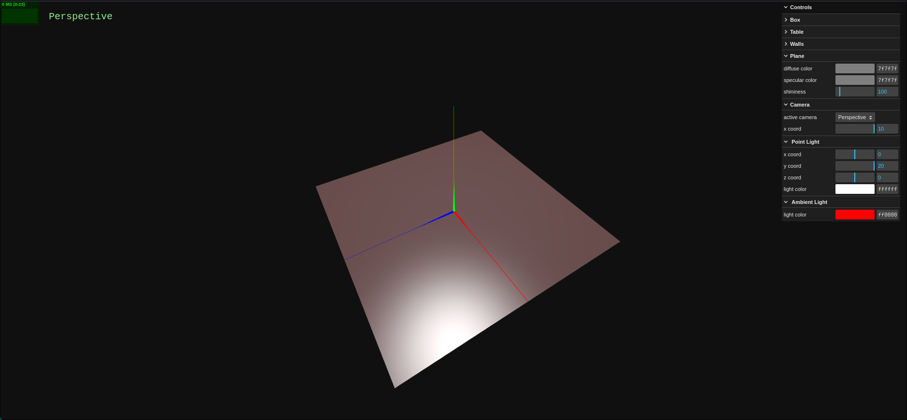
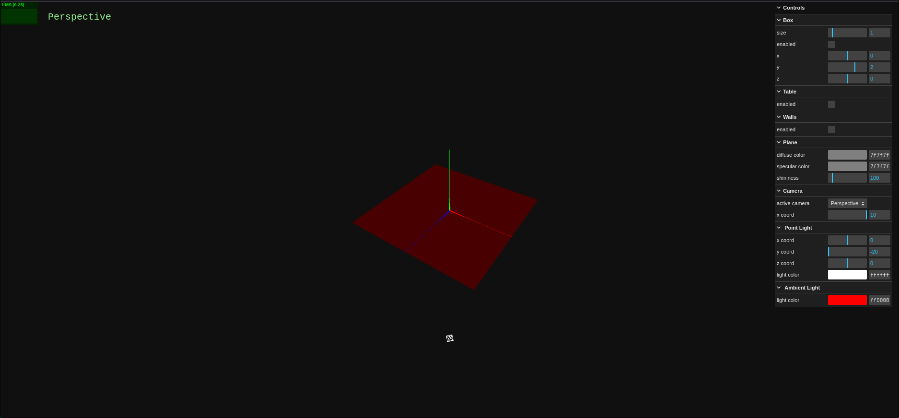

# SGI 2025/2026

## Group T06G04
| Name                 | Number    | E-Mail                        |
| -------------------- | --------- | ----------------------------- |
| Sérgio Nossa         | 202206856 | up202206856@fe.up.pt          |
| Pedro Marinho        | 202206854 | up202206854@fe.up.pt          |
| Ismael Moniz         | 202206871 | up202206871@fe.up.pt          |

----

## Projects

### [PW1 - ThreeJS Basics](pw1)

#### Task A

**Questions**
- Did you observe any differences when changing the order of the lines manipulating the transformations ?

**Surprisingly** there are no differences. If we reverse the order of the transformations we will get the same result. This happens because **Mesh objects**, internally , have a fixed transformation order. In this case it behaves like this:  

- **Scale → Rotation → Position**

The following images show no difference at all after changing the order of the lines of code.

Rotation of 30º then scale:

Scale then rotation of 30º:

#### Task B 

**Questions?** 

- What were the differences between setting the rotation property and calling the rotateX() function? Did it behave as it would in WebGL/WebCGF?

When using duplicating the `rotateX()` function line instead of the one where the rotation is assigned, we observed that, in the first case, the rotation is applied twice and only once in the latter. This happens because in the second case we are setting a static value for the rotation and in the first we are rotating the object by a static amount according to its internal rotation. 

The object when using the `rotateX()` function twice: 

The behavior of `rotateX()` in **three.js** doesn't match the behavior of the `rotate()` function in **WebCGF** as `rotate()` applies a rotation matrix on the global transformation matrix and, as so, the object is rotated around the origin. Meanwhile, `rotateX()` rotates the object in local space. 

#### Task C

**Questions?** 

1. How does the **shininess affect** the material components (ambient, diffuse, specular)?
2. What were the visual differences between changing the **point or the ambient light** to red?
3. What changed visually in the scene when the **light source was moved**? How is that change connected to the **local illumination model**?

##### Question 1

**Phong's local illumination model formula**:

From the formula, which combines the three components (ambient, diffuse, and specular), we can see that the shininess factor `n` only influences the **specular term**.

The specular reflection depends on both the coefficient `ks` and the shininess `n`:

- Increasing `ks` raises the intensity of the highlight.

- Increasing `n` makes the highlight smaller and sharper (glossy surface), while lowering `n` spreads it out (rough surface).

This effect is illustrated below, where `kd​` and `ka` remain constant, and only `ks` and `n` are varied:

##### Question 2

When changing the **point light** to red, the plane becomes noticeably illuminated with red, since the point light contributes to diffuse and specular reflection depending on the light’s position. This creates a strong, localized red effect.

When changing the **ambient light** to red instead, the effect is much weaker: the scene only gets a uniform red tint, with no directional highlights or shading, so the red appears very subtle.

##### Question 3

When the point light was moved from 
`(0,20,0)` to `(0,−20,0)`, the light source no longer illuminated the floor because it was positioned below the plane. As a result, the **diffuse** and **specular** components from the point light disappeared, and only the ambient component remained visible. 
Since the **ambient light was red**, the plane appeared uniformly tinted red.

This matches the local illumination model, where the diffuse and specular terms depend on the angle and position of the light relative to the surface normal. When the light is below the surface, **N⋅L<0**, so those terms contribute nothing.

#### Task D

**Questions?** 

1. Were there any unexpected behaviors with any of the requested changes?
2. Did the light helper behave as expected?

##### Question 1

Yes — the main unexpected behavior was that the **SpotLightHelper** did not always update automatically after changing some spotlight properties, especially the target position. This required explicitly calling `spotHelper.update()` for the changes to be visually reflected. Also, setting the penumbra to very high values (close to 1) caused the spotlight edge to appear extremely soft, which can make the lighting look unnatural if the angle or intensity isn’t adjusted accordingly.

##### Question 2

Yes — the helper correctly represented the spotlight’s position, angle, and target direction, as long as `spotHelper.update()` was called after each change. This confirms that the helper is reliable for visual debugging, but it needs manual updating when modifying dynamic properties such as position, target, angle, or distance.

#### Task E

**Questions?** 

1. Were you able to see changes in real time of the wrap mode? What was necessary for those changes to happen?

##### Question 1

Yes, we were able to see the changes in real time when switching between the different wrap modes. The only thing we had to keep in mind was setting the `needsUpdate` attribute of the texture object to `true` after changing its wrap mode. This forces Three.js to re-upload the texture parameters to the GPU, so the updates become visible immediately in the scene.

