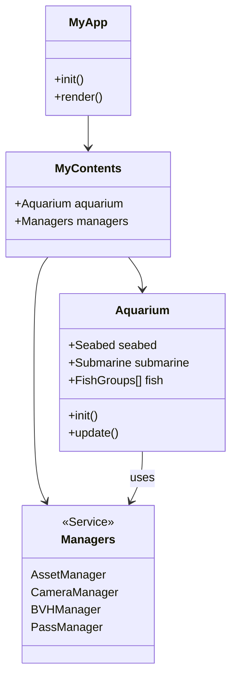

# SGI 2025/2026 - PW2

## Group T06G04
| Name                 | Number    | E-Mail                        |
| -------------------- | --------- | ----------------------------- |
| Sérgio Nossa         | 202206856 | up202206856@fe.up.pt          |
| Pedro Marinho        | 202206854 | up202206854@fe.up.pt          |
| Ismael Moniz         | 202206871 | up202206871@fe.up.pt          |

----
## Project information

### General Overview 

The project follows a strict modular architecture separating the scene graph, logic, and system management.

- **Root Entity:** The **`Aquarium`** class encapsulates the entire ecosystem (seabed, marine life, physics), serving as the single abstraction for the scene content.
- **Manager Layer:** A suite of specialized managers handles global systems:
    - **Asset & Visuals:** 
        - `AssetManager`: Centralizes the asynchronous loading of complex 3D models, textures, and sprites, ensuring resources are ready before the scene starts.
        - `PassManager`: Orchestrates a cinematic post-processing pipeline, layering effects like depth of field.
        - `CameraManager`: detailed control over the user's viewpoint, managing transitions between free-fly, orbital, and fixed camera modes.
    - **Logic & Physics:** 
        - `BVHManager`: Implements a Bounding Volume Hierarchy to spatially index the scene.
        - `CollisionManager`: Resolves interactions between dynamic entities (fish, submarine, etc) and the static environment.
        - `KeyManager` & `TimeManager`: Normalize user input and frame deltas, decoupling simulation logic from framerate for smooth movement.

This design ensures `MyContents.js` acts solely as an orchestrator, injecting dependencies into the `Aquarium`.

#### High Level Architecture Diagram

### Weekly Assignments

#### Week 1: Cameras, Primitives, and Scene Graph

> *Fig 1. Demonstration of camera switching and wireframe mode.*

- **Implementation:**
    - **Scene Graph:** Established the `Aquarium` class as the root node of the scene. Populated it with `Object3D` subclasses using basic placeholder geometries (cubes, spheres, cylinders) to represent entities like terrain, fish, and corals.
    - **Hierarchy:** Structured the scene using group nodes (e.g., a node for all fish, a node for rocks) to ensure transformations applied to parent groups correctly propagate to their children.
    - **Camera System:** Implemented a `CameraManager` supporting three distinct perspectives:
        1. **Free Fly:** A roaming camera controlled by keyboard input.
        2. **Aquarium View:** A fixed static view of the entire scene.
        3. **Target View:** Orbital cameras focused on specific objects.
    - **Debug Tools:** Integrated a GUI toggle for "Wireframe Mode" to inspect the geometry structure.

- **Refinements:**
    - **Recursive Material Traversal:** The wireframe toggle utilizes `scene.traverse` to recursively visit every child node. This ensures that even deeply nested primitives switch state correctly without manually tracking every mesh.
    - **Dynamic Camera Management:** Cameras are stored in a dictionary, allowing the interface to switch views dynamically by key string rather than hardcoded object references, making it easy to add new camera angles later.

#### Week 2: BufferGeometry, LOD, and L-Systems

> *Fig 2. Parametric fish generation and L-System coral growth.*

- **Implementation:**
    - **BufferGeometry (Fish):** Replaced placeholder primitives with custom `THREE.BufferGeometry`. The `Fish` class manually defines vertices and indices to build the body, tail, and fins.
    - **L-Systems (Corals):** Adapted the course's **Stochastic L-System** parser to procedurally generate branching coral structures. Defined custom "Turtle Graphics" rules (interpreting strings like `F`, `+`, `[`, `]`) to create organic shapes.
    - **Level of Detail (LOD):** Integrated `THREE.LOD` to optimize rendering. Objects automatically switch between high-detail meshes and simpler representations based on camera distance.

- **Refinements:**
    - **Parametric Fish Construction:** The fish geometry is not static; the constructor accepts parameters like `bodyLenRatio` and `fatFishRatio`, allowing a single class to generate a diverse population of thin, fat, short, or long fish.
    - **Stochastic Variation:** The L-System parser supports weighted probabilities. A rule like `'X'` can evolve into two different strings based on a random roll (e.g., 70% vs 30%), ensuring no two corals look exactly the same.
    - **Hybrid Mesh Optimization:** The `Fish` class intelligently switches types. High-detail LODs use `SkinnedMesh` (prepared for bone animation), while low-detail LODs degrade to static `Mesh` groups or even invisible objects at extreme distances to save draw calls.

- **Extra Progress:** During this week, the shark model was fully modeled, rigged, animated, and successfully integrated into the project.

- **Postponed Work:**  While the LOD system was implemented this week, fine-tuning of fish-specific LOD thresholds and transitions was finalized in Week 3.

#### Week 3: Animation

> *Fig 3. Skinned fish animation and vertex-shader based sway.*

- **Implementation:**
    - **Skeletal Animation (Skinning):** Rigged the fish `BufferGeometry` with a simple bone structure (Head, Body, Tail). Vertices are weighted to these bones, allowing the fish to swim naturally by rotating the skeleton.
    - **Keyframe System:** Developed a `KeyframedAnimation` class that interpolates an object's position and rotation over time based on a sequence of defined poses (waypoints).
    - **Procedural Seaweed (L-Systems):** :A new L-System object was introduced specifically for seaweed, distinct from corals.
    - **Vertex Displacement:** Animated stationary life (seaweed, corals) using sine-wave deformation to simulate underwater currents.

- **Refinements:**
    - **Instanced Shader Magic:** To maintain high performance, seaweed and corals use `InstancedMesh`. This presented a challenge: standard shaders don't animate instances individually. We solved this by injecting custom GLSL into the vertex shader that manually decodes the `instanceMatrix`, allowing us to apply world-space swaying to thousands of static instances in a single draw call.
    - **Organic De-Synchronization:** To prevent the "robotic" look of everything moving in unison, every fish and seaweed strand is assigned a random time offset (phase). This ensures that while they share the same animation logic, every entity moves independently, creating a natural, chaotic underwater feel.
    - **Robust Interpolation Engine:** The `KeyframedAnimation` class was built as a scalable system. It supports **Linear, Quadratic, and Cubic** interpolation, allowing us to define complex, smooth paths for any object.

- **Postponed work:** The keyframe animation system was entirely postponed to the next checkpoint and the shader-based animation for corals and seaweed was done in week 6. 

#### Weeks 4 & 5: Interaction and Physics

> *Fig 4. Submarine piloting and flocking boids behavior.*

- **Implementation:**
    - **Submarine Controls:** Implemented a playable submarine piloted via keyboard.
        - `W`/`S`: Accelerate forward/backward.
        - `A`/`D`: Yaw (turn) left/right.
        - `P`/`L`: Control ballast (ascend/descend).
    - **Flocking System (Boids):** Fish behave as a cohesive school using Reynolds' rules:
        1. **Separation:** Avoid crowding neighbors.
        2. **Alignment:** Steer towards the average heading of neighbors.
        3. **Cohesion:** Steer towards the average position of neighbors.
    - **Predator Avoidance:** Fish dynamically react to "high danger" entities (Submarine, Sharks), breaking formation to flee.

- **Refinements:**
    - **Inertial Rotor Physics:** The submarine's propeller isn't just linked to speed; it has its own mass and inertia. When the engine stops (`W` released), the rotor spins down gradually (`ROTOR_DECEL`) rather than halting instantly.
    - **Spatial Hashing (Grid):** Flocking is notoriously expensive ($O(N^2)$). We implemented a **Spatial Grid** system (Spatial Hashing) that buckets entities into 3D cells. This allows each boid to query only its immediate neighbors for separation/alignment, enabling us to simulate hundreds of fish at around 60 FPS without brute-force checks.
    - **Procedural Modeling:** The submarine is not a loaded asset; it is constructed entirely from code using hierarchical `THREE.Group`s and primitives (`CapsuleGeometry`, `LatheGeometry`, `ExtrudeGeometry`), demonstrating mastery of the Scene Graph.

- **Postponed work:** The implemention of the flocking system was postponed to next week.

#### Week 6: Acceleration (BVH & Picking)

> *Fig 5. Debug view of BVH rays and object selection.*

- **Implementation:**
    - **Bounding Volume Hierarchy (BVH):** Integrated `three-mesh-bvh` to generate spatial bounds for complex geometry (rocks, terrain, submarine). This replaces standard expensive geometry checks with rapid tree traversal.
    - **Object Picking:** Implemented a raycasting system allowing users to click and select any entity in the scene. Selected objects are highlighted using an emissive overlay.
    - **Optimization GUI:** Added a debug panel control to toggle between **Spatial Grid**, and **BVH** collision modes effectively visualizing the CPU cost of each approach.

- **Refinements:**
    - **Performance Analysis (BVH vs. Grid):** Contrary to initial expectations, the BVH approach proved *less* performant for dynamic flocking than the Spatial Grid. The overhead of casting thousands of rays for fish-to-fish proximity outweighed the benefits. As a result, we prioritized the **Spatial Grid** for the simulation loop, reserving BVH for raycasting.
    - **Ray-Cone Proximity:** For static obstacle avoidance (where precise geometry matters), we utilized the BVH to cast a "Ray Cone" (center + periphery). This allows fish to detect complex terrain shapes ahead of them that a simple bounding sphere would miss.
    - **Hierarchy-Aware Picking:** The picking system is smart; it traverses up the scene graph. Clicking a single propeller blade selects the entire `Submarine` group, and the highlight effect is recursively applied to all child meshes while preserving their original material properties.

- **Postponed work:** All Week 6 features were postponed to the following checkpoint due to unresolved requirements from earlier weeks. During this period, initial work on Week 7 features was started.

#### Week 7: Advanced Textures

> *Fig 6. Terrain displacement and video texture playback.*

- **Implementation:**
    - **Terrain Texturing:** Applied high-resolution albedo, normal, and height maps to the seabed. Configured `RepeatWrapping` to tile textures seamlessly across the large plane.
    - **Video Textures:** Integrated `THREE.VideoTexture` to render dynamic `.mp4` content on the "Sunken TV" and "Treasure Chest" object.
    - **Filtering:** Enabled **MIPMAPS** (Trilinear filtering) and **Anisotropic Filtering** on ground textures to eliminate aliasing and blurring at steep camera angles.
    - **Procedural Fish Skin:** Instead of a static texture, the fish skin is generated procedurally in the fragment shader. We sample a **Perlin Noise** texture at three different scales (low, medium, high frequency) and mix them to create a complex, organic pattern. This noise value then drives a smooth mix between two base colors (e.g., Orange and Yellow), resulting in a natural, non-uniform skin tone.

- **Refinements:**
    - **CPU-Side Displacement:** Standard displacement maps are often visual-only (GPU). We went a step further by sampling the height map's pixel data on the CPU to physically displace the terrain geometry vertices. This allows our physics engine (e.g., Marine Snow landing, camera collision) to interact accurately with the hills and valleys.
    - **Animated Bio-Luminescence:** The fish skin isn't static. We injected a `uTime` uniform into the shader to shift the noise texture coordinates over time, causing the pattern to "crawl" slowly across the body. Additionally, a sine-wave pulse function modulates the skin's brightness, giving the fish a living, breathing bio-luminescent glow.

- **Postponed Work:** The implementation of the treasure chest was postponed to week 10.

#### Week 8: Lighting and Shadows

> *Fig 7. Dynamic spotlights and underwater fog.*

- **Implementation:**
    - **Global Illumination:** Configured a `DirectionalLight` to simulate sunlight, complemented by an `AmbientLight` to soften harsh shadows.
    - **Local Lights:** Attached dual `SpotLight`s to the submarine for forward visibility and a `PointLight` for the warning beacon.
    - **Shadows:** Enabled shadow maps for the main light source, ensuring the submarine and rocks cast realistic shadows on the seabed.

- **Refinements:**
    - **Dynamic Warning System:** The submarine's red warning beacon pulses rhythmically. We used a sine-wave function (`Math.sin(time)`) to synchronize the `PointLight` intensity with the bulb mesh's `emissive` strength.
    - **Atmospheric Depth:** Utilized `THREE.FogExp2` with a deep blue-cyan tint (`0x003d5c`) to fade distant objects into the background, providing crucial depth cues.
    - **Shadow Optimization:** We selectively disabled shadow casting for the terrain itself (it only receives shadows) and small particles to maintain high framerates without sacrificing the visual quality of the main actors.

#### Week 9: Shaders and HUD

> *Fig 8. Periscope HUD with post-processing stack.*

- **Implementation:**
    - **Post-Processing Stack:** Leveraged `EffectComposer` to chain multiple visual effects.
    - **Depth of Field:** Integrated `BokehPass` to simulate camera aperture, focusing on the subject while blurring the background.
    - **Periscope HUD:** Developed a multi-stage shader pipeline for the submarine view:
        1. **Tint:** Greenish/Yellowish underwater filter.
        2. **Scratches:** Static texture overlay simulating lens damage.
        3. **Crosshair:** Central aiming reticle.
        4. **Clip:** Circular vignette to simulate looking through a tube.
        5. **Coordinates:** Real-time XYZ position display using a spritesheet-based text shader.

- **Refinements:**
    - **Modular Pass Architecture:** Instead of a monolithic shader, we built a flexible stack of independent `ShaderPass`es. A state manager (`HUD_STATE_CONFIG`) allows us to instantly swap HUD modes (e.g., from "Basic" to "Full Tactical") by toggling specific passes in the chain.
    - **GPU-Based Text Rendering:** The live coordinate display is *not* an HTML overlay. We engineered a custom shader that maps numeric values to UVs on a font spritesheet. This allows us to render crisp, dynamic text directly inside the post-processing buffer, ensuring it matches the aesthetic of the rest of the HUD.
    - **Aspect Ratio Correctness:** All screen-space effects (circular clips, crosshairs) dynamically update their `aspectRatio` uniform on window resize, guaranteeing that circles remain perfect circles on any display resolution.

#### Week 10: Particle Systems

> *Fig 9. Marine snow with physics collision.*

- **Implementation:**
    - **Marine Snow:** Created a custom particle system (`THREE.Points`) to simulate organic debris falling through the water column. The system handles thousands of particles with individual physics (gravity, drift, sway).
    - **Rising Bubbles (Rift Vents):** Implemented a specialized bubble system (`BubbleColumns`) that spawns rising particles exclusively from the deep terrain rifts. These particles have randomized lifetimes and rise towards the surface before resetting.
    - **Sand Puffs:** Interactive particle effect. When the user clicks on the sandy seabed (using the raycasting system), a burst of sand particles (`SandSystem`) is emitted. These particles follow a parabolic trajectory (hemisphere distribution) and settle back onto the terrain.

- **Refinements:**
    - **Physics Interaction:** The marine snow interacts with the terrain. Particles query the CPU-side height map to detect collisions with the seabed. Upon landing, they perform a small bounce based on a restitution coefficient before settling and fading out.
    - **Thermal Vents:** Particles near the rift zone react to the "heat". If marine snow drifts close to a rift vent, it changes color (glowing orange/red) and is pushed upward or destroyed, simulating the thermal currents.
    - **Efficient Recycling:** All particle systems utilize object pooling (recycling). Instead of creating/destroying `THREE.Points` every frame (which would cause garbage collection stutters), particles are simply reset and repositioned when they die or exit the view volume.

### Extras

#### Blender Integration

> *Fig 10. The handmade Shark: Mesh, Armature, and Animation workflow in Blender.*

To achieve a higher degree of visual fidelity, we integrated a pipeline for importing complex `.glb` assets from Blender.

- **Environment Assets:** We curated a collection of high-quality models from external sources to populate the scene, including detailed shells and ancient ruins, which add narrative depth to the seabed.

- **The Custom Shark:**
    Distinct from the downloaded assets, the **Shark** was created entirely from scratch by the team.
    - **Modeling:** Sculpted and retopologized manually.
    - **Rigging:** Rigged with a custom armature to support dynamic swimming deformation.
    - **Animation:** Features hand-crafted animations for swimming, exported and controlled via our `AnimationMixer` logic in Three.js.

#### Realistic Lighting (HDRI)

> *Fig 11. The "Hall of Finfish" HDRI environment map acting as the aquarium store background.*

To enhance the atmosphere, we implemented a custom `HDRIManager` to load High Dynamic Range environments.
- **Scenario:** We used the "Hall of Finfish" HDRI, which represents the interior of an aquarium store.
- **Function:** This environment acts as a "skybox" enveloping our entire tank, effectively placing our simulated aquarium inside a larger, realistic room.
- **Visuals:** Beyond just being a background, this map provides the lighting data for the scene, allowing the submarine's metal and glass to reflect the store's lights and windows, grounding our project in a believable physical space.

#### Dynamic Water Surface

> *Fig 12. Dynamic water surface reflections and the surrounding aquarium store environment.*

To complete the aquarium illusion, we added a realistic water surface at the top of the tank.
- **Vertex Displacement:** We hooked into the `onBeforeCompile` stage of a `MeshStandardMaterial`. A height map texture is sampled in the vertex shader to physically displace the water plane's vertices.
- **Wave Animation:** By scrolling the texture coordinates with a `time` uniform, we create rolling waves that ripple across the surface.
- **Complex Motion:** We combine the Red, Green, and Blue channels of the height map with different multipliers (`offsetR`, `offsetG`, `offsetB`) to create chaotic, non-repetitive wave patterns that look organic rather than mechanical.
- **Integration:** The surface uses the global `envMap` to reflect the "aquarium store" ceiling, seamlessly blending the water with the outside world.

#### Procedural Seabed Placement

> *Fig 13. Debug view showing the bounding circles and non-overlapping distribution of rocks and corals.*

We implemented a robust "Circle Packing" algorithm to distribute hundreds of items (rocks, corals, shells, chests) naturally across the seabed without overlap.
- **Bounding Circle Logic:** Every object type (from small shells to the large sunken ship) automatically calculates its own `baseRadius` by measuring its bounding box at runtime.
- **Collision Padding:** When attempting to place an object, the `Seabed` class assigns it a randomized "Personal Space" (padding). It then checks this candidate circle against the circles of all previously placed objects.
- **Height Awareness:** Once a valid 2D (X, Z) spot is found, the system queries the terrain's height map to drop the object perfectly onto the sand, ensuring it doesn't float or clip.
- **Result:** This creates a natural, non-uniform distribution where clusters of life can form, but objects never intersect physically.
    
    
#### Rift Terrain 

> *Fig 14. The procedural rift with magma floor and blended rock walls.*

The rift is a major terrain feature created by stacking displacement maps.
- **Dual Displacement:** We apply a secondary "Rift Map" (`rift-map`) on top of the standard Perlin noise height map. This map subtracts height values significantly in specific areas, carving out deep trenches in the seabed.
- **Custom Shader Blending:** To make the rift look distinct from the sandy floor, we hooked into the `onBeforeCompile` stage of the `MeshStandardMaterial`.
    - **Tri-Planar Logic:** The shader uses the `riftMap` value and the absolute world height (`vHeight`) to create masks.
    - **Texture Mixing:** It seamlessly blends three different texture sets:
        1. **Sand:** The default seabed.
        2. **Rift Wall:** Applied to the steep vertical slopes of the trench (using `rift-rock` textures).
        3. **Magma Floor:** Applied to the deepest parts of the trench (using `magma` textures) to simulate a volcanic vent.
- **Physics Integration:** Crucially, this displacement happens on both the **GPU** (for rendering) and the **CPU** (for physics). The `TerrainSegment` class samples the height map pixel data to update the actual geometry vertices, allowing the particle systems and camera to physically collide with the rift walls and floor.

----
### Issues/Problems

- **Dynamic Entity Clipping:** Although we handle collision detection for moving entities (like the submarine and fish), there are occasional instances where they may clip into static objects or the terrain. The system handles most interactions correctly, but it is not 100% fail-proof during complex maneuvers.
- **Post-Processing Lighting Artifacts:** We observed a noticeable shift in scene lighting and color tone when toggling between the **Depth of Field (Bokeh)** effect and the standard render. This suggests a discrepancy in how the `EffectComposer` pipeline handles gamma correction or tone mapping compared to the default `WebGLRenderer` path, which we haven't yet fully resolved.

### Future Work/Improvements

- **Advanced Particle Physics:** Currently, particles like marine snow only collide with the seabed. Future improvements would include collision detection against dynamic objects (Submarine) and static props (Rocks, Corals).
- **Robust Collision Physics:** Implement a more advanced physics engine to completely eliminate submarine clipping with static geometry.
- **Expanded Ecosystem:** Introduce more diverse marine life, such as **Manta Rays**, Jellyfish, or Crabs, along with a wider variety of static ruins and flora to enrich the environment.
- **Optimization Strategy:** As the scene complexity grows, we would look into more aggressive optimization techniques (like GPU instancing for rocks or occlusion culling) to ensure the project maintains stable FPS even with thousands of entities.